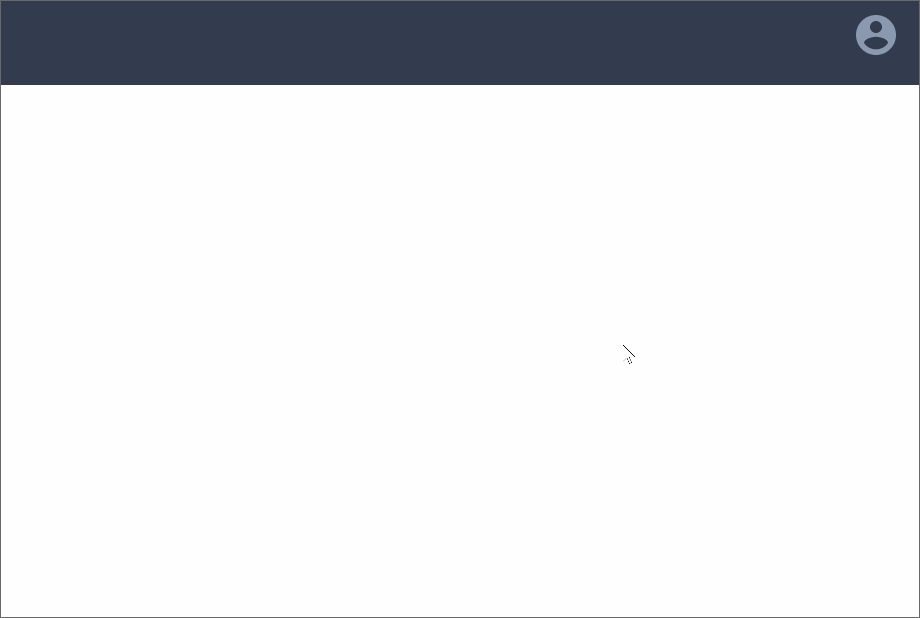
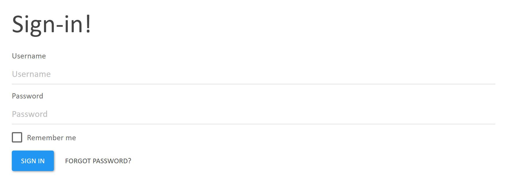
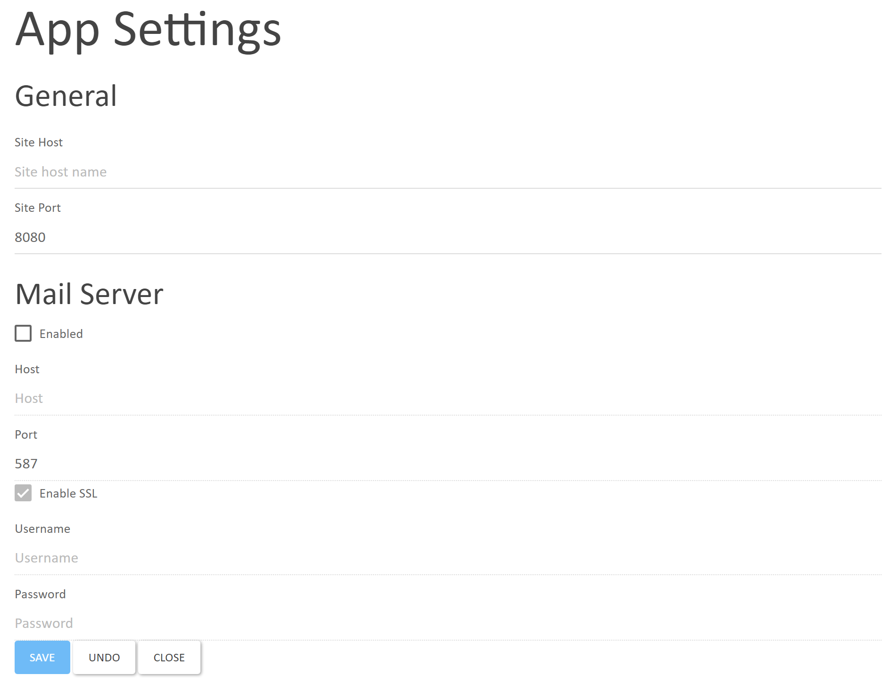
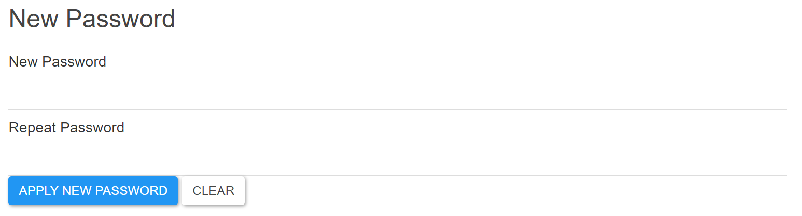

Sign In
=========

Simple user authentication app. Features include:

- authenticate with a username and password
- password reminder using email
- change password for existing users
- settings page to provide mail server configuration (SMTP)

## Create the first user

To create the first user, open [`http://localhost:8080/signin/generateadminuser`](http://localhost:8080/signin/generateadminuser). This generates an admin user with default credentials (username `admin`, password `admin`). The default user will be generated only if there are no users in database.

## Sign in an existing user

To sign in an existing user in standalone mode, go to [`http://localhost:8080/signin/signinuser`](http://localhost:8080/signin/signinuser).

It's also possible to sign in using one of the partial views listed below when they are mapped to a blending point in any other app. By default, it's configured to show the expandable sign in form (`/signin/signinuser`) in [Launcher](https://github.com/StarcounterApps/Launcher) and [Website](https://github.com/StarcounterApps/Website) apps.

## Developer instructions

For developer instructions, go to [CONTRIBUTING](CONTRIBUTING.md)

## Mappable partial views

### GET /signin/user

Expandable icon with a sign-in form and a button to restore the password. Used in toolbars (Launcher, Website, etc).

For a signed in user, the icon displays triggers partial from the Images app, which displays the Illustration of the Person that is assigned to the System User.

Screenshot:



### GET /signin/signinuser

Inline sign-in form and a button to restore the password. Used as a full page form in standalone apps.

Screenshot:



### GET /signin/signinuser?`{string OriginalUrl}`

Same as above but with redirection to a URL after successful sign-in. Used in UserAdmin.

Screenshot:


### GET /signin/admin/settings

Settings page. Includes the mail server configuration form (SMTP). Used in Launcher.

#### Settings for Gmail

The following settings work for using Gmail as the SMTP server:

- Host: `smtp.gmail.com`
- Port: `587`
- Enable SSL: (checked)
- Username: (your Gmail email address)
- Password: (your Gmail password)

Note that you need to set `Allow less secure apps` to `ON` in your Google Account settings.

Screenshot:



### GET /signin/user/authentication/settings/`{SystemUser ObjectID}`

Password change form for existing users. Used in UserAdmin.

Screenshot:



### GET /signin/partial/user/image

Default user image.

Screenshot:


### Usage

To use Sign In apps' forms in your app, create an empty partial in your app (e.g. `/YOURAPP/YOURPAGE?{?}`) and map it to one of the above URIs using `Blender` API:

```cs
StarcounterEnvironment.RunWithinApplication("SignIn", () => {
    Handle.GET("/signin/signinuser-YOURAPP?{?}", (string objectId) => {
        return Self.GET("/signin/signinuser?{?}" + objectId);
    });

    Blender.MapUri("/signin/signinuser-YOURAPP?{?}", "signinuser-YOURAPP");
});
Blender.MapUri("/YOURAPP/YOURPAGE?{?}", "signinuser-YOURAPP");
```

Next, include that partial using in your JSON tree using `Self.GET("/YOURAPP/YOURPAGE?" + originalUrl)` when you encounter a user who is not signed in.


## License

MIT
