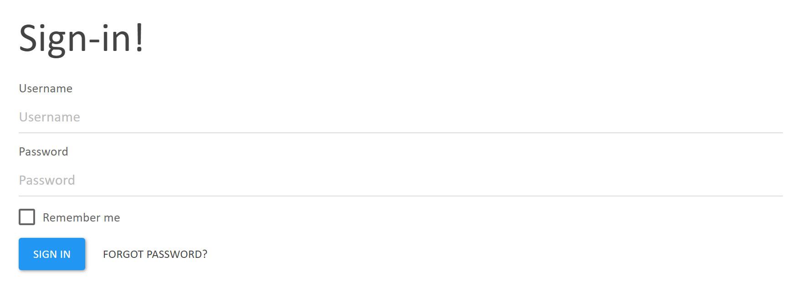
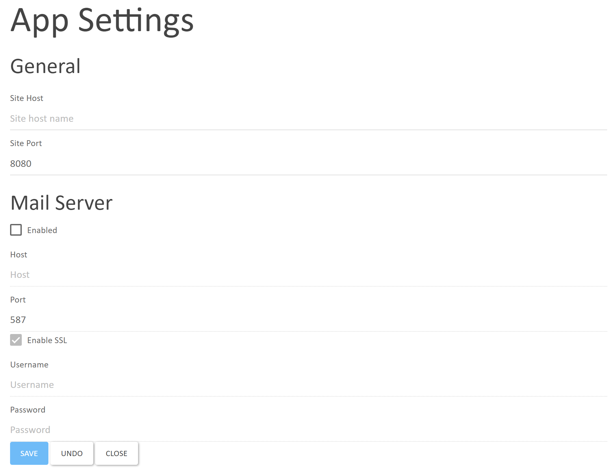
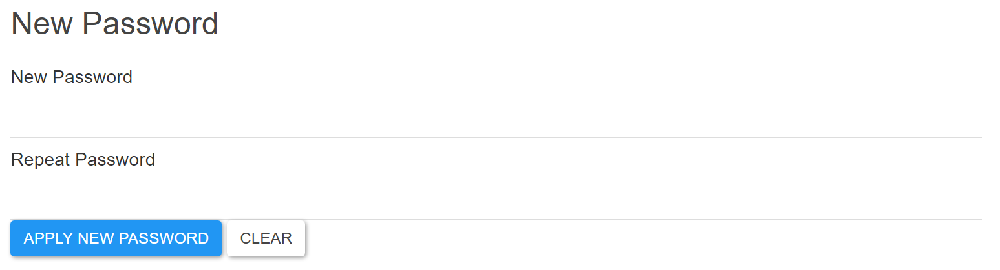

# Blendable views

## /signin/user

Expandable icon with a sign-in form and a button to restore the password. Used in toolbars (Launcher, Website, etc).

For a signed in user, the icon displays triggers partial from the Images app, which displays the Illustration of the Person that is assigned to the System User.

Screenshot:

## /signin/signinuser

Inline sign-in form and a button to restore the password. Used as a full page form in standalone apps.

Screenshot:

## /signin/signinuser?`{string OriginalUrl}`

Same as above but with redirection to a URL after successful sign-in. Used in UserAdmin.

Screenshot:

## /signin/settings

Settings page. Includes the mail server configuration form (SMTP). Used in Launcher.

#### Settings for Gmail

The following settings work for using Gmail as the SMTP server:

- Host: `smtp.gmail.com`
- Port: `587`
- Enable SSL: (checked)
- Username: (your Gmail email address)
- Password: (your Gmail password)

Note that you need to set `Allow less secure apps` to `ON` in your Google Account settings.

Screenshot:

## /signin/user/authentication/settings/{[Simplified.Ring3.SystemUser](https://github.com/StarcounterApps/Simplified/blob/master/Ring3/User/SystemUser.cs)}

Password change form for existing users. Used in UserAdmin.

Screenshot:

## /signin/partial/user/image

Default user image.

Screenshot:

## /signin/app-name

Presents an icon for the app.
